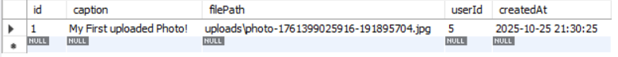
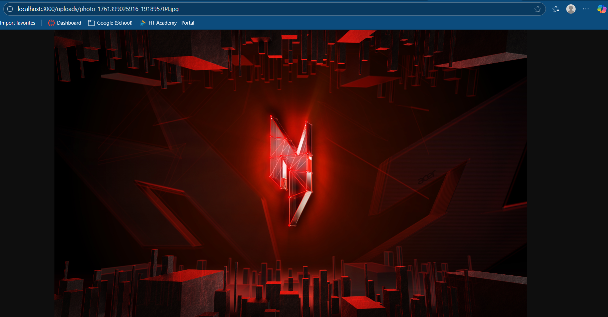
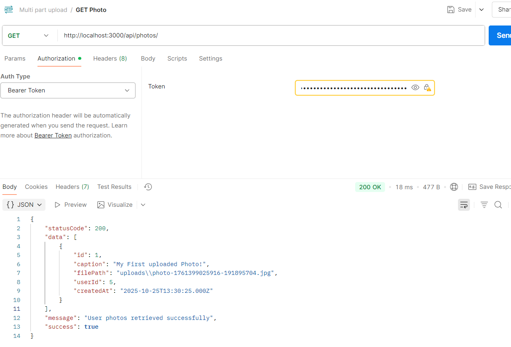
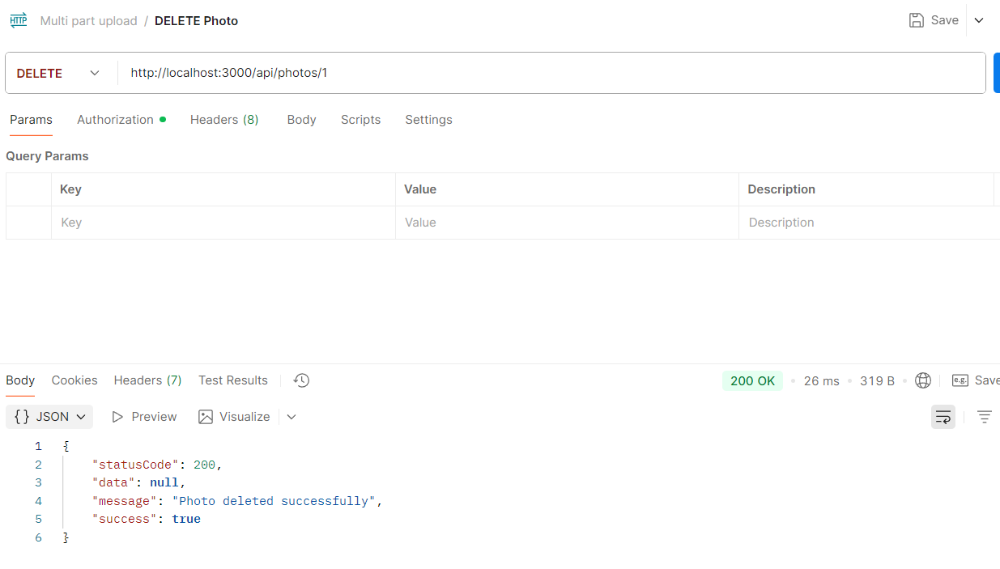
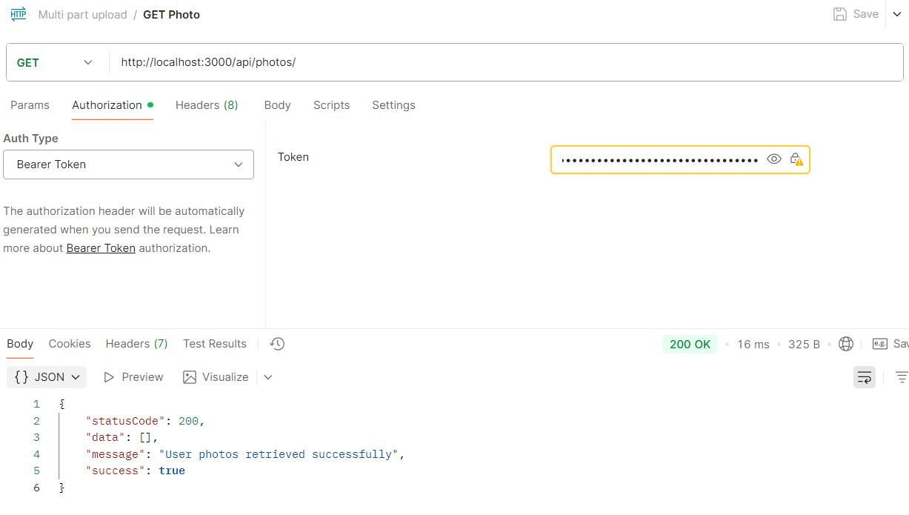
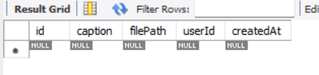
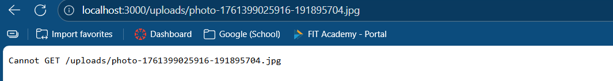

# The Photo API - Handling File Uploads
This Laboratory is created by Matthew Gerard P. Aceret - IT4B

### Tasks done
- Installed multer and implement a new table for handling photos
- Created middleware for multer... It is used for determining the destination to be saved (being uploads/).
- Created a service, controller and route for the photos
- Mounted a new route of photos and enable the access via the uploads

### Testing
1. 'uploads' folder has been created
 
2. Server is running

3. Logged and JWT has been copied

4 - 5. Upload is a success and the image has been placed in the uploads folder

6. Verification

Deleting Image

