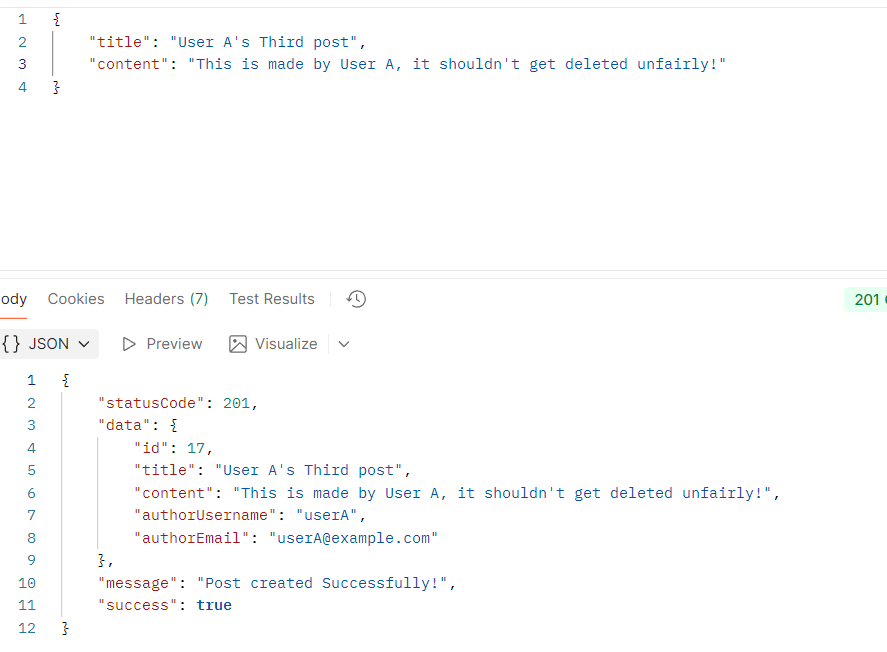
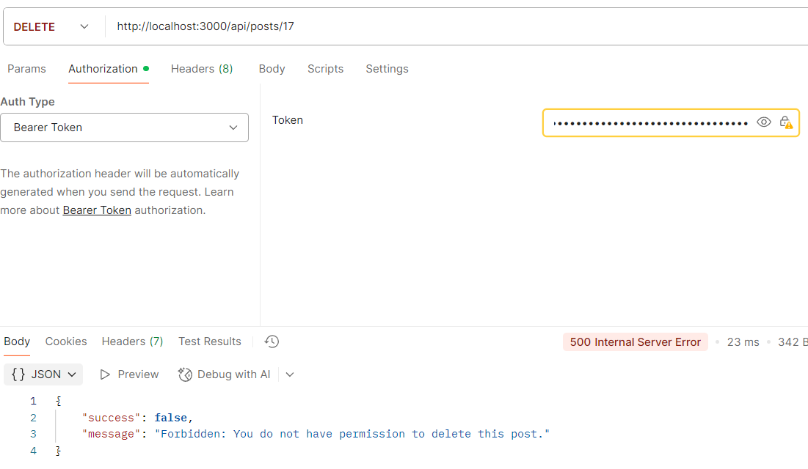
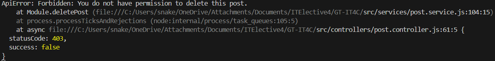
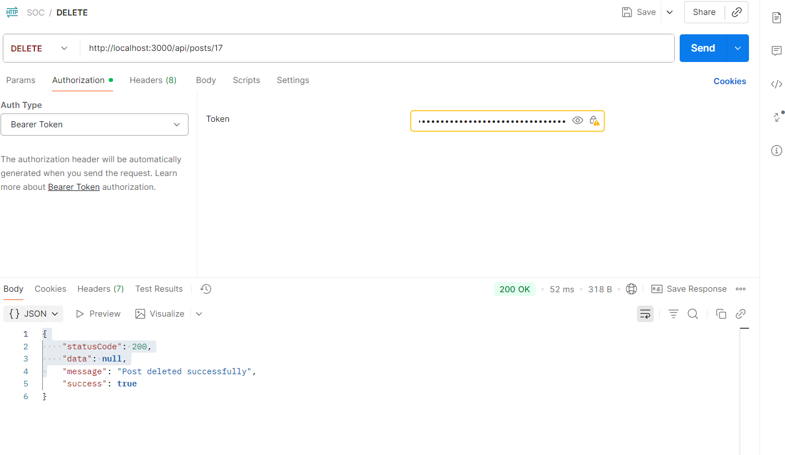

# Authorization Laboratory
- In part 1, managed to confirm that User B can delete User A's Post, going from ID 14 to 16 (15 being A's post)
- Modified both service and controller post javascripts to accept and validate authorid is the same as userid; cause an error if it does not match.
- Modified the routes to be considered protected as well.
- Modified the errorhandler middleware from a basic error handling to a smarter or much more sensitive middleware.

## Testing

- Note: Had to include p.authorId in the constant in order to fulfill the condition of authorid and userid checking
